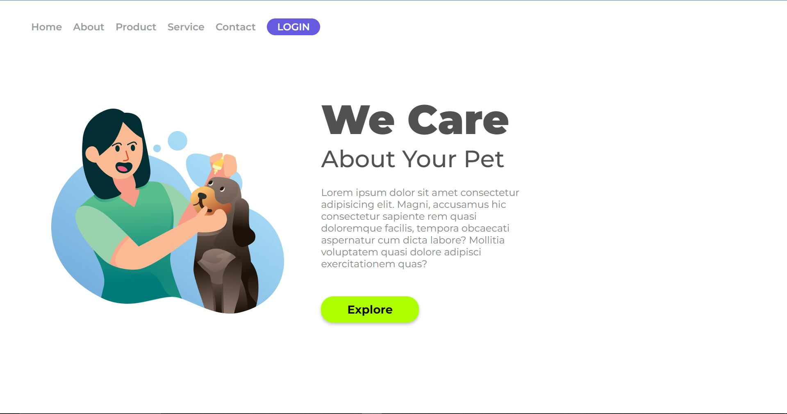

# 
 Iterface We Care 

 

###### 
 Esté projeto foi desenvolvido do curso DevClub Full Stack 

#### 
 Esté Projeto foi utilizado as tecnologias de marcação de texto e folha de estilo em cascata 

- [x] HTML5 
- [x] CSS3

